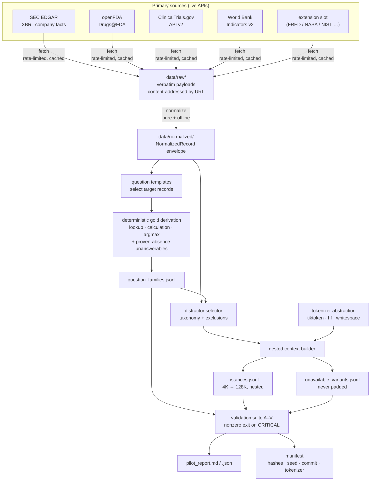

# longctx-dataset

Reproducible generation of a **long-context, same-domain-interference QA dataset** built
from authoritative primary sources.

> **Scope of this repository.** It generates and validates *datasets*. It does not run an
> LLM, score hallucinations, judge answers, or perform statistical analysis. Those are
> deliberately later phases.

---

## 1. Research goal

The eventual experiment asks one question:

> **As the amount of supplied same-domain context grows, does an LLM's hallucination /
> error rate increase?**

To answer that cleanly, everything except context length must be held constant. This
project produces the dataset that makes such a comparison valid.

## 2. Why question families are reused across context lengths

The experimental unit is a **question family**, not a question. One family — say
`SEC_0004` — is rendered at every context length:

```
SEC_0004_4K   SEC_0004_8K   SEC_0004_16K   SEC_0004_32K   SEC_0004_64K   SEC_0004_128K
```

Across those six instances:

| held constant | allowed to vary |
|---|---|
| question text (byte-identical) | number of surrounding distractor records |
| gold answer and its normalized form | which distractor records appear |
| gold evidence record IDs | total context length |
| the rendered gold evidence block (byte-identical, SHA-256 verified) | |

If the question or the gold answer changed with length, any measured difference in error
rate would confound *length* with *difficulty*. Reusing the family is what makes length
the only independent variable, and the validator (checks **G/H/I**) fails hard if that
invariant is ever violated.

## 3. Gold evidence vs distractors

**Gold evidence** is the minimal set of source records the answer is derived from. It is
stored denormalized on the family (entity, concept, period, unit, version, value,
provenance URL) so the answer can be re-verified without re-fetching anything.

**Distractors** are every other record placed in the context. They are **real records
from the same primary source** — never invented, never altered. Each carries an explicit
taxonomy label describing its relationship to the target:

| type | meaning |
|---|---|
| `WRONG_VERSION` | same entity, metric, period, unit — different filing/revision/submission |
| `WRONG_UNIT` | same entity, metric, period — different unit or measurement basis |
| `WRONG_PERIOD` | same entity and metric — a different year, quarter, or instant |
| `WRONG_ENTITY` | same metric and period — a different company, country, trial, or product |
| `WRONG_FIELD` | same entity — a different field/concept |
| `NEAR_MATCH_VALUE` | numerically within 5% of a target value while being a different fact |
| `OTHER_SAME_DOMAIN` | a real same-source record with no closer relationship |

This is the point of the whole design: long context here is **competing evidence**, not
padding. No Wikipedia, no lorem ipsum, no unrelated documents.

Two exclusions are enforced when selecting distractors, not merely checked afterwards:

* no record that would itself satisfy the question's target conditions (that would create
  a second, unlabelled source of truth — check **V**);
* for unanswerable families, no record matching the missing concept or a declared alias
  at the period the question names (check **S**).

## 4. Answerable vs unanswerable construction

**Answerable** families derive their gold answer deterministically from structured
records. An LLM never authors an answer. The permitted paths are a direct field lookup,
a declared calculation (`ratio_percent`, `growth_percent`, `difference`, `ratio`, `sum`,
`count`, `days_between`), or an argmax over supplied records. Every calculation stores its
operands, the values used, the formula, the raw result and the rounded result, and the
validator recomputes all of it (checks **D/T**).

**Unanswerable** families are *constructed*, never relabelled. Each one targets a field
that is genuinely absent from the primary source:

| domain | how absence arises authentically |
|---|---|
| World Bank | the API returns an observation with `value: null` for that country-year |
| SEC | the filer reports no facts under that us-gaap concept at all |
| ClinicalTrials.gov | the registry record does not populate that field (e.g. no results posted) |
| Drugs@FDA | openFDA lists no `route` / `marketing_status` for that specific product |

Before a family is emitted the generator proves absence by exhaustive scan of the
normalized pool, and records the proof in `unanswerable_spec`:

```json
{
  "reason_code": "NO_VALUE_REPORTED_IN_SOURCE",
  "reason": "The World Bank API returned an observation for POL/NY.GDP.PCAP.CD/1960 with a null value ...",
  "missing_entity_id": "POL", "missing_concept": "NY.GDP.PCAP.CD", "missing_period": "1960",
  "verified_absent_in_pool": true,
  "forbidden_concept_aliases": ["NY.GDP.PCAP.CD"]
}
```

Gold outcome is `gold_answer: null` and `gold_answer_normalized: "INSUFFICIENT_EVIDENCE"`.

Note the deliberate scoping: when the question names a period, *other* periods of the
same series stay in the context. They do not disclose the withheld value, and their
presence is exactly what makes abstention a real test — the model sees neighbouring
years and must decline to interpolate.

## 5. Source provenance

Three layers are preserved and never collapsed:

```
data/raw/          verbatim API payloads, content-addressed by request URL
data/normalized/   one atomic fact per record, in a common envelope
data/pilot/        question families and context instances
```

Every normalized record carries `raw_reference` (source URL, raw file, JSON pointer,
retrieval timestamp). Every family carries `source_provenance` at API-call granularity.
Because `data/raw/` is cached, the pilot can be regenerated byte-for-byte long after the
live APIs have moved on.

### Implemented adapters

| domain | source | credentials |
|---|---|---|
| `SEC` | [SEC EDGAR XBRL company facts](https://data.sec.gov/api/xbrl/companyfacts/) | **`SEC_USER_AGENT` required** (real contact address) |
| `FDA` | [openFDA Drugs@FDA](https://api.fda.gov/drug/drugsfda.json) | none (optional `OPENFDA_API_KEY` raises rate limits) |
| `CLINICAL_TRIALS` | [ClinicalTrials.gov API v2](https://clinicaltrials.gov/api/v2/studies) | none |
| `WORLD_BANK` | [World Bank Indicators API v2](https://api.worldbank.org/v2/) | none |

SEC publishes a hard rate limit and requires a descriptive User-Agent containing a
**reachable** address. This project will not fabricate one: if `SEC_USER_AGENT` is unset
or looks like a placeholder, the adapter refuses to run and the pipeline records an
explicit blocker instead of quietly substituting other data.

## 6. Context nesting

All lengths for a family draw from **one** ordered candidate list. Growth only ever
prepends before the current head or appends after the current tail:

```
                    ┌──────────── C128K ────────────┐
              ┌────────────── C64K ──────────────┐
                    ┌──────── C32K ────────┐
                        ┌── C16K ──┐
   ...  d9  d7  d5  d3  d1 [GOLD] d2  d4  d6  d8  d10  ...
                        └── C8K ───┘
```

So `C4K ⊂ C8K ⊂ C16K ⊂ C32K ⊂ C64K ⊂ C128K` — and more strongly, each shorter context's
record sequence is an **ordered subsequence** of the next. The validator checks the
stronger property (check **J**), because mere set inclusion would not catch a context
that had been regenerated independently and happened to overlap.

Records are added to whichever side currently holds fewer tokens, which is precisely the
condition for the gold block's midpoint to sit at 50%. A short look-ahead window prefers
the candidate whose size best closes the gap between the two sides.

### Honesty about length

A variant is emitted only if it reaches `min_fill_ratio` (default 0.95) of its nominal
target **using real records**. If the authentic pool runs out, or if the length is too
short for whole records to place the evidence within the position tolerance, the variant
is written to `unavailable_variants.jsonl` with the token count actually achieved and the
reason. Nothing is ever padded to hit a number.

## 7. Tokenizer configuration

The model under test has not been chosen, so no tokenizer is treated as authoritative.
The tokenizer is a configured parameter with a `backend:name` id:

```yaml
tokenizer:
  id: "tiktoken:cl100k_base"     # or "hf:meta-llama/Llama-3-8B", or "whitespace:v1"
  fallback_id: "whitespace:v1"
  allow_fallback: false          # fail loudly rather than silently mis-measure
```

Every instance records the tokenizer id and version actually used. `whitespace:v1` is a
dependency-free approximation that keeps the unit tests offline; it flags itself as
`is_approximate` so nothing downstream can mistake it for a real tokenizer. Changing the
tokenizer means changing the config and re-running `build-contexts` — no code changes.

## 8. Reproducibility

| mechanism | where |
|---|---|
| configurable seed, derived per (domain, template) | `config.seed` → `questions.base.derive_seed` |
| config hash over the parsed config (not the YAML bytes) | `PipelineConfig.compute_hash()` |
| git commit, generator + schema version, tokenizer id | `generation_metadata`, manifest |
| source retrieval timestamps and request URLs | `raw_reference`, `source_provenance` |
| SHA-256 of every output file | `manifest.files[]` |
| **timestamp-independent content hash** of each output | `manifest.content_sha256` |
| SHA-256 of every context string and of each gold block | `Instance.context_sha256`, `lineage.gold_block_sha256` |

Sub-seeds are *derived* rather than drawn from one global RNG, so adding or reordering a
template does not silently change every other template's output. All JSON is written with
sorted keys.

**How to actually check a rerun.** Compare `manifest.content_sha256`, not the file
hashes. Every run stamps a fresh `generated_at` into `generation_metadata`, so raw file
hashes always differ even when nothing meaningful changed. The content hash strips
wall-clock fields and covers everything a rerun must reproduce exactly — questions, gold
answers, evidence, contexts and their ordering. Verified in this pilot: across two runs
with the same seed and raw cache, all 192 context strings were byte-identical.

## 9. Running the pilot

```bash
pip install -e ".[dev,parquet]"

# SEC requires a real, reachable contact address. Never a placeholder.
export SEC_USER_AGENT="Your Org Name your.real.email@domain.com"

python -m longctx_dataset build-pilot --config config/pilot.yaml
```

Or stage by stage — every stage reads and writes disk, so any one can be re-run alone and
`fetch` is idempotent (raw payloads are content-addressed by request URL):

```bash
python -m longctx_dataset fetch              --config config/pilot.yaml
python -m longctx_dataset normalize          --config config/pilot.yaml
python -m longctx_dataset generate-questions --config config/pilot.yaml
python -m longctx_dataset build-contexts     --config config/pilot.yaml
python -m longctx_dataset validate           --config config/pilot.yaml
python -m longctx_dataset report             --config config/pilot.yaml

python -m longctx_dataset stats          --config config/pilot.yaml
python -m longctx_dataset export-schemas --out data/schemas
```

`--domain SEC,FDA` restricts `fetch`/`normalize` to specific sources.

## 10. Validating

```bash
python -m longctx_dataset validate --config config/pilot.yaml   # nonzero exit on CRITICAL
python -m pytest -q                                             # offline unit + integration tests
```

| id | check | id | check |
|---|---|---|---|
| A | unique IDs | L | target-position compliance |
| B | no duplicate question families | M | record-boundary integrity |
| C | valid source provenance | N | unit consistency in calculations |
| D | deterministic gold recomputation | O | answer-type / schema validity |
| E | gold evidence present in answerable contexts | P | distractor metadata completeness |
| F | gold evidence absent for unanswerable | Q | no NaN / invalid numeric answers |
| G | identical question across variants | R | no truncation through target evidence |
| H | identical gold answer across variants | S | no leakage for unanswerable families |
| I | identical gold evidence across variants | T | calculation operands recomputable |
| J | nested-context lineage | U | all five question types represented |
| K | token-length compliance | V | no duplicate answer sources |

The test suite runs fully offline against small committed fixtures carved from authentic
API responses (provenance preserved). Tests requiring network are marked `network` and
deselected by default. Several tests inject corruption — a tampered gold answer, a broken
nesting chain, a drifting question, an over-length context — and assert the validator
*catches* it, so the suite tests the validator rather than assuming it.

## 11. Output schemas

`python -m longctx_dataset export-schemas` writes JSON Schema for every public model.

**`data/pilot/question_families.jsonl`** — one row per family:

```jsonc
{
  "schema_version": "1.0.0", "question_family_id": "SEC_0004",
  "domain": "SEC", "source_name": "SEC_EDGAR_XBRL_COMPANYFACTS",
  "question_type": "RETRIEVAL_CALCULATION", "question": "…operating margin for CY2011…",
  "answerable": true,
  "gold_answer": "5.93%", "gold_answer_normalized": 5.93,
  "answer_type": "PERCENT", "answer_unit": "percent", "numeric_tolerance": 0.005,
  "gold_evidence": [ { "record_id": "…", "role": "numerator", "value": 26491000000.0, … } ],
  "gold_evidence_ids": ["…"],
  "calculation_spec": {
    "operation": "ratio_percent", "formula": "(numerator / denominator) * 100",
    "operands": {"numerator": "…", "denominator": "…"},
    "operand_values": {"numerator": 26491000000.0, "denominator": 446509000000.0},
    "raw_result": 5.932915126010898, "rounded_result": 5.93, "round_decimals": 2
  },
  "target_conditions": {"records": [{"entity_id": "0000104169", "concept": "us-gaap:…", …}]},
  "source_provenance": [ … ], "generation_metadata": { … }
}
```

**`data/pilot/instances.jsonl`** — one row per (family × length), adding `instance_id`,
`context_length_nominal`, `context_tokens_actual`, `tokenizer`, `target_position_relative`,
`target_evidence_start_token`/`_end_token`, `distractor_counts`, `distractors[]`,
`context`, `context_record_ids`, `context_sha256`, `lineage`, `stats`.

**`data/pilot/unavailable_variants.jsonl`** — variants that could not be built honestly,
with `reason_code`, `reason`, `tokens_achieved`, `records_available`.

Parquet mirrors are written when `write_parquet: true`. JSONL is authoritative: Parquet
needs one type per column, so the `gold_answer_normalized` union (float, or the string
`INSUFFICIENT_EVIDENCE`) is stored as text there with a parallel `gold_answer_numeric`.

Contexts use explicit, citable record boundaries so the eventual experiment can ask the
model which records it used:

```
<RECORD id="SEC_0000104169_Revenues_USD_CY2011_..." source="SEC_EDGAR_XBRL_COMPANYFACTS">
entity: WALMART INC. [0000104169]
field: Revenues [us-gaap:Revenues]
period: CY2011
unit: USD
value: 446509000000.0
version: 10-K|0000104169-14-000019
form: 10-K
</RECORD>
```

## 12. Known limitations

1. **World Bank API instability — the one real source blocker in this pilot.**
   `api.worldbank.org` behaved badly throughout the run, in three distinct ways:
   * `date=YYYY:YYYY` range queries return **HTTP 502** while the same query without the
     filter returns 200 — so the year window is applied client-side instead;
   * large result sets **hang** rather than erroring (1 country × 66 years is fine,
     5 countries times out) — so each request asks for a single country;
   * under sustained use the endpoint starts refusing traffic entirely, returning fast
     502s to everything.

   The adapter works around the first two. The third is not something a client can fix.
   The pilot therefore uses the largest fully-retrieved rectangle — **4 of the 20 intended
   indicators × 20 countries**, 1990–2024. That is enough to exercise every World Bank
   question type (the four indicators include the `NY.GDP.MKTP.CD` / `NY.GDP.MKTP.KD`
   current-vs-constant pair that drives unit binding, and 80 genuine null observations
   that drive abstention), but it is the thinnest of the four domain pools and it costs
   the cross-indicator per-capita template, which needs `SP.POP.TOTL`.

   `config/pilot.yaml` is scoped to exactly that rectangle, and the World Bank
   `normalize()` filters the raw cache to the configured indicators and countries — so
   the normalized layer is a pure function of (cache + config) and re-running `fetch`
   costs nothing. `config/production.yaml` retains the full intended 20-indicator set.
   The other three sources (SEC, openFDA, ClinicalTrials.gov) were fully available and
   fast: 259,528 / 960 / 2,400 raw records in under 11 seconds combined.
2. **Distractor pool depth bounds the maximum length.** A 128K context needs on the order
   of 2,000 authentic records. Families whose domain pool is shallow legitimately produce
   fewer variants; these are recorded, not padded.
3. **Token offsets for the evidence span are computed by encoding the prefix separately.**
   BPE is not strictly compositional, so the reported start token can differ from a
   single-pass encoding by ~1 token at a record boundary. Irrelevant at these scales, but
   it is an approximation.
4. **`WRONG_VERSION` distractors are scarce.** They require the same fact restated across
   filings, which is genuinely rare outside SEC. The taxonomy is not uniformly populated.
5. **FDA strength parsing is deliberately shallow.** Only the first magnitude/unit pair of
   a free-form strength string is extracted; the original string is always preserved, and
   ratio questions require both operands to share a parsed unit.
6. **Question wording is templated.** Phrasings are natural but not linguistically varied;
   this is a deliberate trade for gold-answer determinism.
7. **No semantic judge, no scoring, no analysis.** Out of scope by design.
8. **The fifth production domain is unbound.** `config/production.yaml` reserves 100
   families for it; no adapter is registered yet.

## 13. Scaling to 500 question families

`config/production.yaml` already encodes the target: 500 families, 100 per domain across
five domains, with the 20/30/15/15/20 question-type mix. Scaling is a config change, not
a code change. Before running it:

1. **Set the tokenizer** to the model actually under test.
2. **Deepen the entity pools** — production config already widens SEC to 20 filers, FDA to
   25 ingredients, ClinicalTrials to 16 queries, and World Bank to 30 countries × 20
   indicators. Roughly, a 128K context consumes ~2,000 records, so each domain needs a
   pool comfortably larger than that after exclusions.
3. **Choose and register the fifth domain** (see §14). FRED is the strongest candidate:
   its vintage/revision series give a first-class original-vs-revised axis, which is the
   scarcest question type today.
4. **Budget the World Bank fetch** generously given the API's current state.
5. **Run `validate` and require a zero exit** before treating the output as a dataset.

```bash
export SEC_USER_AGENT="…"
python -m longctx_dataset build-pilot --config config/production.yaml
```

## 14. Adding a new source adapter

Nothing outside the new module needs to change.

1. Add `src/longctx_dataset/sources/<name>.py` with a `SourceAdapter` subclass decorated
   with `@register_adapter`, setting `domain`, `source_name`, `api_base`, `api_version`.
2. Implement `fetch()` (write verbatim payloads via `HTTPClient`, return a
   `RetrievalResult`) and `normalize()` (a pure, offline function of the cached payloads
   returning `NormalizedRecord`s). Implement `check_availability()` if the source needs
   credentials — return a blocker string rather than fabricating them.
3. Import the module in `sources/__init__.py` for side-effect registration.
4. Add question templates in `src/longctx_dataset/questions/<name>_templates.py`, each a
   `QuestionTemplate` subclass decorated with `@register_template`. Provide at least one
   per question type, including an `UNANSWERABLE` template that *proves* absence against
   the pool.
5. Add a small authentic fixture under `tests/fixtures/raw/<name>/` and extend
   `tests/conftest.py`.
6. Enable the domain in the config with an `n_families` and a `question_type_mix`.

## 15. Architecture



## 16. Repository layout

```
config/           pilot.yaml, production.yaml
src/longctx_dataset/
  cli.py            subcommands, one per stage
  config.py         typed config + stable config hash
  schemas.py        versioned Pydantic models + JSON Schema export
  pipeline.py       stage orchestration
  report.py         pilot report (markdown + json)
  sources/          base.py (adapter contract, HTTP, registry) + one module per source
  normalize/        record ID generation, value coercion, indexed RecordPool
  questions/        base.py (templates, seeding, calculations) + per-domain templates
  distractors/      taxonomy.py (classification), selector.py (ordering + exclusions)
  context/          tokenizer.py (abstraction), builder.py (nesting, placement)
  validation/       gold.py, leakage.py, contexts.py, dataset.py, result.py
  storage/          io.py (deterministic JSONL/JSON), manifests.py
tests/            unit + integration, offline, with authentic fixtures
data/             raw/ normalized/ pilot/ manifests/ reports/
```

## 17. Licence and data terms

Code is MIT. The *data* is not: SEC EDGAR and ClinicalTrials.gov are US public domain,
openFDA is public domain but its terms note results are unvalidated, and World Bank Open
Data is CC BY-4.0. Each normalized record and question family carries its source and
licence note; honour them when redistributing generated datasets.
