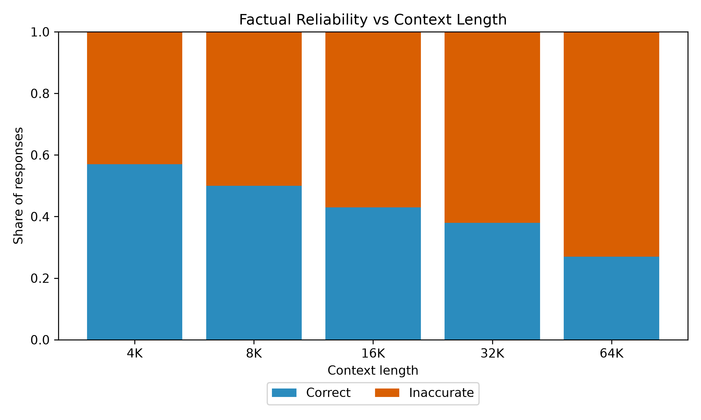
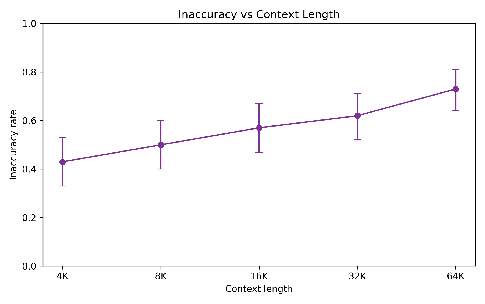
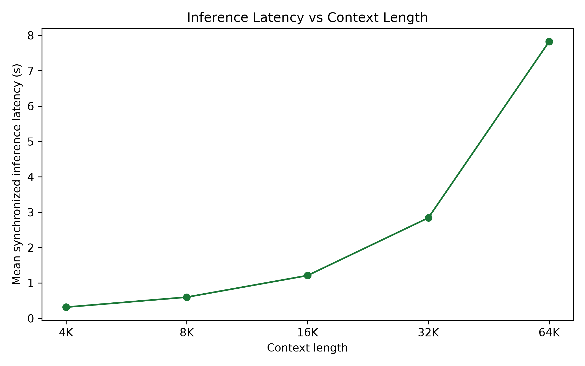
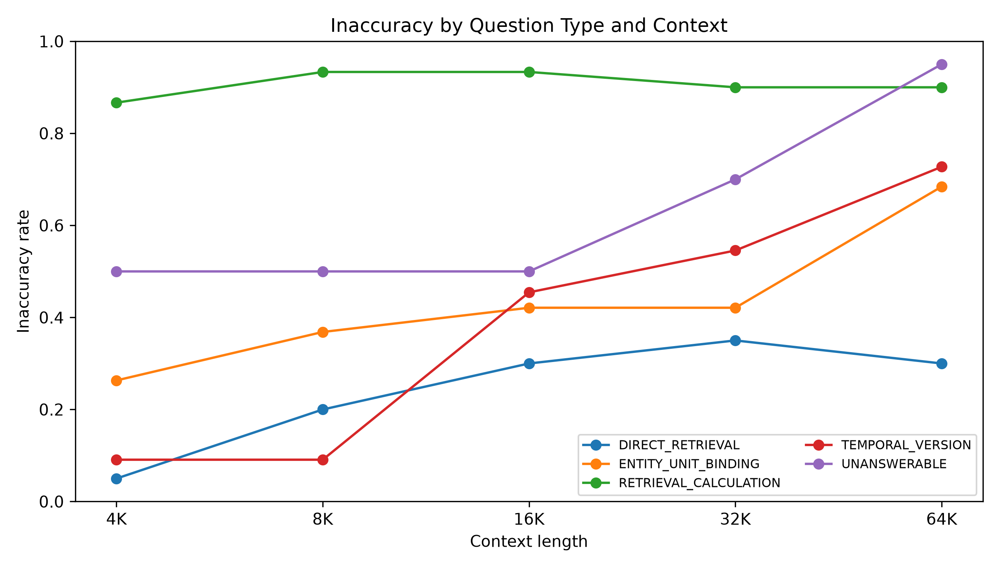
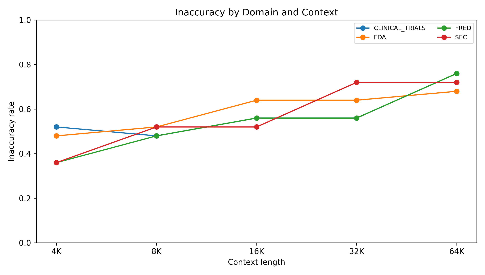

# Long-Context Factual Reliability in Llama 3.2 3B Instruct

## Executive Summary

Total inaccuracy increased from 43% at 4K to 73% at 64K. GEE-estimated inaccuracy OR per context doubling was 1.352 (95% CI [1.203, 1.519], p=4.06e-07).

## Central Results

| Context   |   N | Correct   | Inaccurate   | Inaccuracy 95% CI   | Mean inference latency   |
|:----------|----:|:----------|:-------------|:--------------------|:-------------------------|
| 4K        | 100 | 57%       | 43%          | [33%, 53%]          | 0.317 s                  |
| 8K        | 100 | 50%       | 50%          | [40%, 60%]          | 0.601 s                  |
| 16K       | 100 | 43%       | 57%          | [47%, 67%]          | 1.212 s                  |
| 32K       | 100 | 38%       | 62%          | [52%, 71%]          | 2.842 s                  |
| 64K       | 100 | 27%       | 73%          | [64%, 81%]          | 7.824 s                  |

## Figures

### Figure 1. Figure 1. Factual reliability vs context length.

Correct and inaccurate responses sum to 100% at each context length.

### Figure 2. Figure 2. Inaccuracy vs context length.

GEE OR per context doubling = 1.352, 95% CI [1.203, 1.519], p = 4.06e-07.

### Figure 3. Figure 3. Inference latency vs context length.

Mean synchronized generation latency rises as input length increases.

### Figure 4. Inaccuracy by Question Type & Context.

Subgroup results are exploratory because cells are smaller than the primary repeated-measures analysis.

### Figure 5. Inaccuracy by Domain & Context.

Subgroup results are exploratory because cells are smaller than the primary repeated-measures analysis.

## Provenance

- Final dataset hash: `6fdfaa035b5da2211e813353916902c871e783ecfa993615db672f62bcb8e327`
- Frozen grader hash: `d9282a0ccc50daba3bfd232c058dfbab63a5c19a7323d585a7c2236b3a6c4ba8`