# Longer Contexts Reduce Factual Reliability: Separating Hallucinatory and Grounded Errors in Llama 3.2 3B

**Experiment D final report**  
Generated: 2026-08-11  
**Model:** `meta-llama/Llama-3.2-3B-Instruct`  
**Model revision:** `0cb88a4f764b7a12671c53f0838cd831a0843b95`  
**Benchmark:** 500 question families, six context lengths, 3,000 attempted inference instances  

## Executive Summary

This study asks how increasing long-context length affects factual reliability when an LLM must answer factual questions from authentic but competing primary-source records. The benchmark used 500 question families across SEC, FDA/Drugs@FDA, ClinicalTrials.gov, and FRED/ALFRED. Each family was evaluated at 4K, 8K, 16K, 32K, 64K, and an empirically hardware-bounded 82K context condition. The model was `meta-llama/Llama-3.2-3B-Instruct`, run with BF16 greedy decoding on an RTX 4090 using the frozen `llama_chat_v4` answer-only prompt.

Overall inaccuracy increased from **49.6% at 4K** to **70.7% at 82K**. A repeated-measures GEE logistic model clustered by `question_family_id` found an odds ratio of **1.232** per doubling of rendered input tokens, 95% CI **[1.178, 1.288]**, p = **8.66e-20**. Grounded Inaccuracy also increased substantially, from **15.4%** to **30.3%**, OR **1.215**, 95% CI **[1.153, 1.280]**, p = **3.34e-13**.

Hallucinatory Inaccuracy increased in the full dataset, OR **1.070**, 95% CI **[1.027, 1.115]**, p = **0.00133**. However, after excluding UNANSWERABLE questions, Hallucinatory Inaccuracy decreased with context length, OR **0.942**, 95% CI **[0.906, 0.980]**, p = **0.00275**. Thus the full-dataset hallucination increase is driven primarily by increasing failed abstention on unanswerable cases, while answerable factual tasks show a growing grounded contextual-confusion problem rather than more unsupported fabrication.

## 1. Introduction and Motivation

The central research question is: how does increasing context length affect factual reliability when an LLM must retrieve and reason over authentic but competing contextual records? A single hallucination rate is insufficient for this setting. Long-context failures can arise from unsupported fabrication, selection of the wrong legitimate contextual fact, wrong entity binding, wrong temporal binding, wrong version binding, calculation mistakes, or failure to abstain when evidence is absent.

This report separates inaccurate responses into Hallucinatory Inaccuracy and Grounded Inaccuracy. Inaccurate means any response that does not match the deterministic gold answer. Hallucinatory Inaccuracy is an inaccurate factual response unsupported by the supplied context, primarily `UNSUPPORTED_VALUE` and `FAILED_TO_ABSTAIN`. Grounded Inaccuracy is an inaccurate response grounded in information actually present in the supplied context, including `WRONG_ENTITY`, `WRONG_PERIOD`, `WRONG_VERSION`, `WRONG_FIELD`, `WRONG_UNIT`, `WRONG_SERIES_VARIANT`, `CALCULATION_ERROR`, and `UNNECESSARY_ABSTENTION`.

## 2. Data Sources

The benchmark uses four authoritative primary-source domains: SEC filings, FDA/Drugs@FDA records, ClinicalTrials.gov records, and FRED/ALFRED time-series records. Each domain contributes 125 question families, for 500 total families. Authentic source records were used to construct target evidence, deterministic gold answers, same-domain distractors, temporal competitors, version competitors, entity competitors, series/unit competitors, and unanswerable cases.

| Domain             |   Families | Role                                                              |
|:-------------------|-----------:|:------------------------------------------------------------------|
| SEC                |        125 | Company financial filings, concepts, periods, units, versions     |
| FDA / Drugs@FDA    |        125 | Drug application/product records, strengths, dosage forms, routes |
| ClinicalTrials.gov |        125 | Trial identifiers, statuses, dates, arms, posted results          |
| FRED / ALFRED      |        125 | Economic time series, vintages, units, seasonal/series variants   |

## 3. Question-Family Design

| Question Type         |   Families | Purpose                                                       |
|:----------------------|-----------:|:--------------------------------------------------------------|
| DIRECT_RETRIEVAL      |        100 | Retrieve one explicitly requested fact from competing records |
| RETRIEVAL_CALCULATION |        150 | Retrieve multiple operands and compute a deterministic result |
| TEMPORAL_VERSION      |         55 | Select the correct date, period, or version among competitors |
| ENTITY_UNIT_BINDING   |         95 | Bind a requested value to the correct entity, unit, or series |
| UNANSWERABLE          |        100 | Return INSUFFICIENT_EVIDENCE when required evidence is absent |
| Total                 |        500 |                                                               |

The benchmark contains 400 answerable families and 100 unanswerable families. Each family keeps a fixed question, gold answer, evidence policy, and answerability across all context lengths; only the supplied same-domain context grows.

## 4. Context-Length Design

The context ladder is 4K, 8K, 16K, 32K, 64K, and 82K. The 82K condition is the hardware-validated maximum condition for RTX 4090 DynamicCache inference in this experiment and is not a doubling of 64K. Statistical models therefore used `log2(rendered_input_tokens)`, implemented as `log2(input_tokens)` from the frozen scored dataset.

| Context   | Mean Rendered Input Tokens   |
|:----------|:-----------------------------|
| 4K        | 4,273.3                      |
| 8K        | 8,330.5                      |
| 16K       | 16,442.3                     |
| 32K       | 32,671.4                     |
| 64K       | 65,126.1                     |
| 82K       | 81,745.1                     |

## 5. Experiment Size and Runtime Outcome

The frozen benchmark has 500 families and six context conditions, giving 3,000 attempted inference instances. There were 2,998 successful generations and two CUDA OOM runtime failures, both at 82K. Runtime failures are reported separately and are not counted as factual inaccuracies.

## 6. Model and Inference Configuration

The model was `meta-llama/Llama-3.2-3B-Instruct`, revision `0cb88a4f764b7a12671c53f0838cd831a0843b95`, run on an NVIDIA GeForce RTX 4090. Inference used BF16, batch size 1, standard Hugging Face DynamicCache, greedy decoding, `do_sample=False`, `num_beams=1`, and `max_new_tokens=128`, with no quantization, no cache offloading, and no model offloading. The prompt was `llama_chat_v4`, prompt hash `5d2869822989e19b`, with frozen date `09 Aug 2026`. The output contract was `ANSWER: <answer>` or `ANSWER: INSUFFICIENT_EVIDENCE`. Among successful outputs, there were zero malformed outputs, zero outputs reaching the 128-token cap, and zero repetitive or degenerate outputs.

## 7. Grading

Grading was deterministic. The frozen grader hash was `d9282a0ccc50daba3bfd232c058dfbab63a5c19a7323d585a7c2236b3a6c4ba8`. There were 2,998 successful outputs graded, 19 cases manually adjudicated under the frozen rules, and zero unresolved ambiguous cases. Seven adjudicated cases were actually correct grader edge cases; twelve were grounded `WRONG_ENTITY` cases. No manual case was converted to hallucination, and the deterministic grader itself was not modified.

| Outcome                  |   Count |
|:-------------------------|--------:|
| Correct                  |    1176 |
| Inaccurate               |    1822 |
| Hallucinatory Inaccuracy |    1132 |
| Grounded Inaccuracy      |     690 |
| Runtime Failures         |       2 |
| Ambiguous                |       0 |

## 8. Primary Factual-Reliability Results

| Context   |   Gradable N | Correct   | Inaccurate   | Inaccuracy 95% CI   | Hallucinatory Inaccuracy   | Grounded Inaccuracy   |   Runtime Failures | Mean Latency   |
|:----------|-------------:|:----------|:-------------|:--------------------|:---------------------------|:----------------------|-------------------:|:---------------|
| 4K        |          500 | 50.4%     | 49.6%        | 45.2%-54.0%         | 34.2%                      | 15.4%                 |                  0 | 0.316 s        |
| 8K        |          500 | 45.6%     | 54.4%        | 50.0%-58.8%         | 37.2%                      | 17.2%                 |                  0 | 0.598 s        |
| 16K       |          500 | 41.2%     | 58.8%        | 54.4%-63.2%         | 34.8%                      | 24.0%                 |                  0 | 1.212 s        |
| 32K       |          500 | 38.4%     | 61.6%        | 57.4%-65.8%         | 38.2%                      | 23.4%                 |                  0 | 2.842 s        |
| 64K       |          500 | 30.4%     | 69.6%        | 65.6%-73.6%         | 41.8%                      | 27.8%                 |                  0 | 7.827 s        |
| 82K       |          498 | 29.3%     | 70.7%        | 66.6%-74.7%         | 40.4%                      | 30.3%                 |                  2 | 11.260 s       |

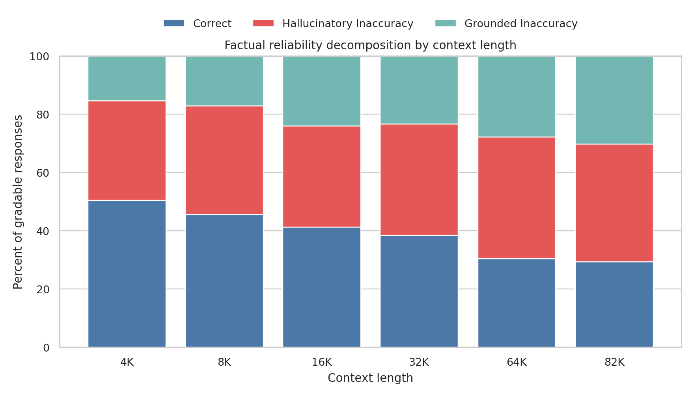

## 9. Primary Statistical Model

The primary repeated-measures model was GEE logistic regression with outcome `inaccurate`, predictor `log2(rendered_input_tokens)`, and clustering by `question_family_id`. Each +1 increase in the predictor corresponds to a doubling of actual rendered context. The OR was **1.232**, 95% CI **[1.178, 1.288]**, p = **8.66e-20**. Each doubling of rendered context length was associated with approximately a 23.2% increase in the odds of producing an inaccurate response; this is an odds increase, not a percentage-point increase.

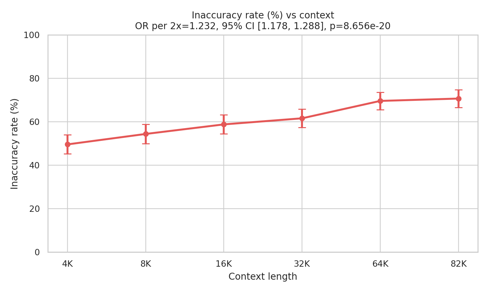

## 10. Hallucinatory Inaccuracy

Hallucinatory Inaccuracy increased in the full benchmark from 34.2% at 4K to 40.4% at 82K. The GEE OR was **1.070**, 95% CI **[1.027, 1.115]**, p = **0.00133**. This result should be interpreted together with the UNANSWERABLE sensitivity analysis below.

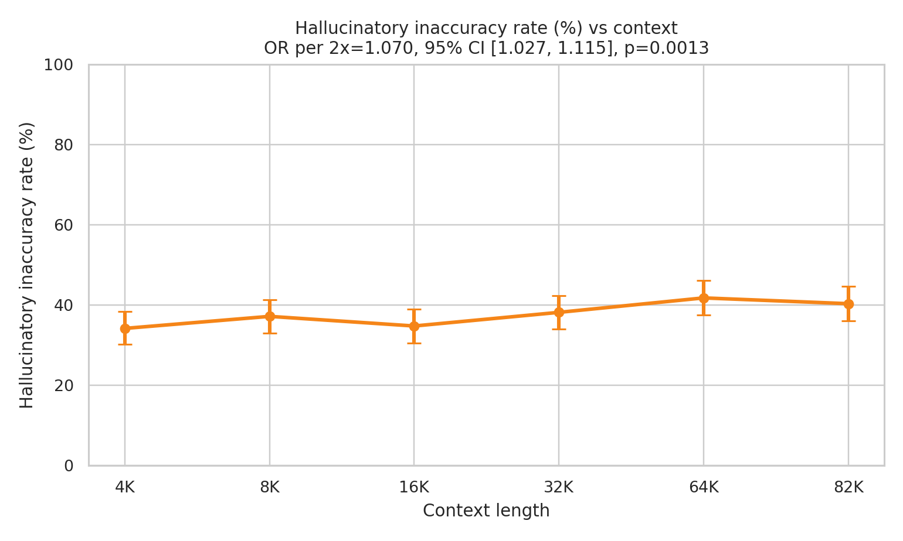

## 11. Grounded Inaccuracy

Grounded Inaccuracy increased from 15.4% at 4K to 30.3% at 82K. The GEE OR was **1.215**, 95% CI **[1.153, 1.280]**, p = **3.34e-13**. These errors involve legitimate contextual information but incorrect binding or reasoning, and are a central finding of the study.

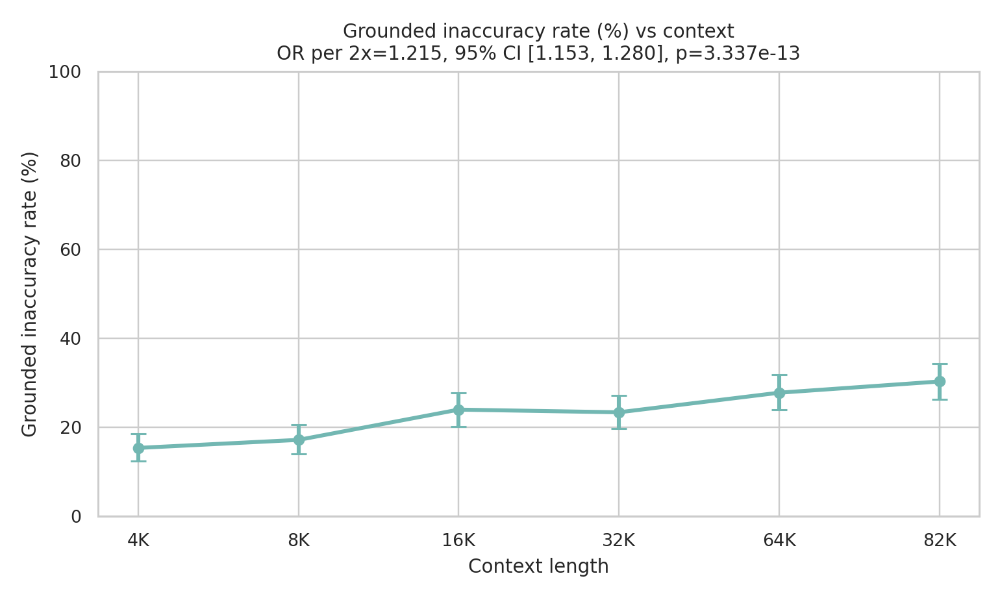

## 12. Sensitivity Analyses

### 12.1 Excluding UNANSWERABLE Questions

| Outcome                  |    OR | 95% CI         |   p-value |
|:-------------------------|------:|:---------------|----------:|
| inaccurate               | 1.129 | [1.081, 1.180] |  5.3e-08  |
| hallucinatory_inaccuracy | 0.942 | [0.906, 0.980] |  0.00275  |
| grounded_inaccuracy      | 1.234 | [1.166, 1.306] |  2.66e-13 |

After excluding UNANSWERABLE families, overall inaccuracy still increased and grounded inaccuracy increased strongly, but Hallucinatory Inaccuracy decreased with context length. This indicates that the full-dataset increase in Hallucinatory Inaccuracy is driven primarily by increasing failures to abstain on unanswerable tasks. Among answerable factual questions, hallucination decreases while grounded contextual errors increase.

### 12.2 Complete-Case Sensitivity

| Outcome                  |    OR | 95% CI         |   p-value |
|:-------------------------|------:|:---------------|----------:|
| inaccurate               | 1.232 | [1.178, 1.289] |  8.14e-20 |
| hallucinatory_inaccuracy | 1.072 | [1.028, 1.117] |  0.00105  |
| grounded_inaccuracy      | 1.213 | [1.151, 1.278] |  4.69e-13 |

The complete-case analysis used 498 families with all six successful conditions and 2,988 observations. Conclusions were unchanged.

## 13. Paired McNemar Tests

All higher contexts were significant versus 4K for overall inaccuracy after Holm correction. Hallucinatory Inaccuracy was significant for 4K vs 8K, 64K, and 82K. Grounded Inaccuracy was significant for 4K vs 16K, 32K, 64K, and 82K.

| Outcome                  | Comparison   |   Paired N |   Rate Difference (pp) |   4K=0, Higher=1 |   4K=1, Higher=0 |    Raw p |   Holm p | Holm Significant   |
|:-------------------------|:-------------|-----------:|-----------------------:|-----------------:|-----------------:|---------:|---------:|:-------------------|
| inaccurate               | 4K_vs_8K     |        500 |                    4.8 |               41 |               17 | 0.00223  | 0.00223  | True               |
| inaccurate               | 4K_vs_16K    |        500 |                    9.2 |               66 |               20 | 6.67e-07 | 1.33e-06 | True               |
| inaccurate               | 4K_vs_32K    |        500 |                   12   |               88 |               28 | 2.09e-08 | 6.27e-08 | True               |
| inaccurate               | 4K_vs_64K    |        500 |                   20   |              124 |               24 | 1.89e-17 | 7.57e-17 | True               |
| inaccurate               | 4K_vs_82K    |        498 |                   21.3 |              129 |               23 | 4.33e-19 | 2.17e-18 | True               |
| hallucinatory_inaccuracy | 4K_vs_8K     |        500 |                    3   |               24 |                9 | 0.01353  | 0.04059  | True               |
| hallucinatory_inaccuracy | 4K_vs_16K    |        500 |                    0.6 |               35 |               32 | 0.80719  | 0.80719  | False              |
| hallucinatory_inaccuracy | 4K_vs_32K    |        500 |                    4   |               51 |               31 | 0.03524  | 0.07048  | False              |
| hallucinatory_inaccuracy | 4K_vs_64K    |        500 |                    7.6 |               75 |               37 | 0.00042  | 0.0021   | True               |
| hallucinatory_inaccuracy | 4K_vs_82K    |        498 |                    6.4 |               69 |               37 | 0.00244  | 0.00976  | True               |
| grounded_inaccuracy      | 4K_vs_8K     |        500 |                    1.8 |               39 |               30 | 0.33556  | 0.33556  | False              |
| grounded_inaccuracy      | 4K_vs_16K    |        500 |                    8.6 |               68 |               25 | 9.38e-06 | 2.81e-05 | True               |
| grounded_inaccuracy      | 4K_vs_32K    |        500 |                    8   |               70 |               30 | 7.85e-05 | 0.00016  | True               |
| grounded_inaccuracy      | 4K_vs_64K    |        500 |                   12.4 |               90 |               28 | 8.91e-09 | 3.57e-08 | True               |
| grounded_inaccuracy      | 4K_vs_82K    |        498 |                   14.9 |               96 |               22 | 3.26e-12 | 1.63e-11 | True               |

## 14. Question-Type Analysis

| Question Type         | 4K Inaccuracy   | 82K Inaccuracy   | 4K Hallucinatory   | 82K Hallucinatory   | 4K Grounded   | 82K Grounded   |
|:----------------------|:----------------|:-----------------|:-------------------|:--------------------|:--------------|:---------------|
| DIRECT_RETRIEVAL      | 24.0%           | 37.0%            | 0.0%               | 1.0%                | 24.0%         | 36.0%          |
| ENTITY_UNIT_BINDING   | 25.3%           | 50.5%            | 4.2%               | 2.1%                | 21.1%         | 48.4%          |
| RETRIEVAL_CALCULATION | 94.0%           | 89.9%            | 78.0%              | 64.9%               | 16.0%         | 25.0%          |
| TEMPORAL_VERSION      | 18.2%           | 67.3%            | 1.8%               | 9.1%                | 16.4%         | 58.2%          |
| UNANSWERABLE          | 49.0%           | 97.0%            | 49.0%              | 97.0%               | 0.0%          | 0.0%           |

UNANSWERABLE failures rose from approximately 49.0% at 4K to 97.0% at 82K, explaining much of the full-dataset Hallucinatory Inaccuracy increase. TEMPORAL_VERSION inaccuracy rose from approximately 18.2% to 67.3%, indicating increasing temporal/version confusion. DIRECT_RETRIEVAL produced mostly grounded failures with near-zero unsupported hallucination. RETRIEVAL_CALCULATION had high error rates across context lengths. ENTITY_UNIT_BINDING also showed increasing inaccuracy, mainly through grounded errors. These subgroup analyses are exploratory.

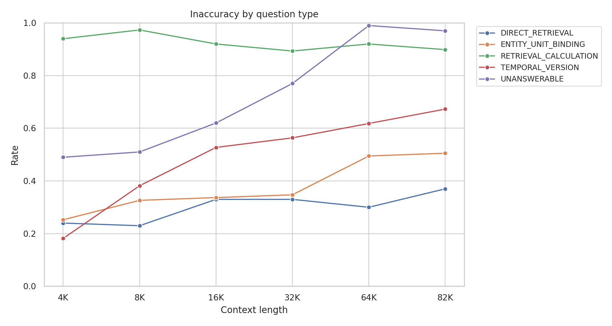

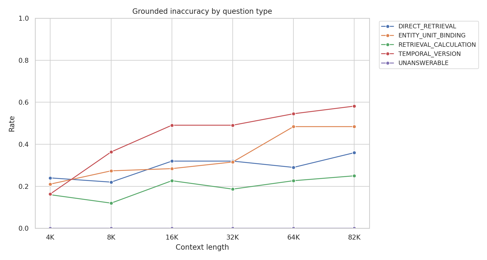

## 15. Domain Analysis

| Domain          | 4K Inaccuracy   | 82K Inaccuracy   | 4K Hallucinatory   | 82K Hallucinatory   | 4K Grounded   | 82K Grounded   |
|:----------------|:----------------|:-----------------|:-------------------|:--------------------|:--------------|:---------------|
| CLINICAL_TRIALS | 44.0%           | 59.2%            | 40.8%              | 36.8%               | 3.2%          | 22.4%          |
| FDA             | 58.4%           | 62.4%            | 53.6%              | 44.8%               | 4.8%          | 17.6%          |
| FRED            | 43.2%           | 79.0%            | 20.8%              | 36.3%               | 22.4%         | 42.7%          |
| SEC             | 52.8%           | 82.3%            | 21.6%              | 43.5%               | 31.2%         | 38.7%          |

SEC and FRED showed the largest overall inaccuracy increases. FDA was comparatively flatter. ClinicalTrials increased mainly through grounded errors. Domain-level results should be interpreted cautiously because subgroup cell sizes are smaller.

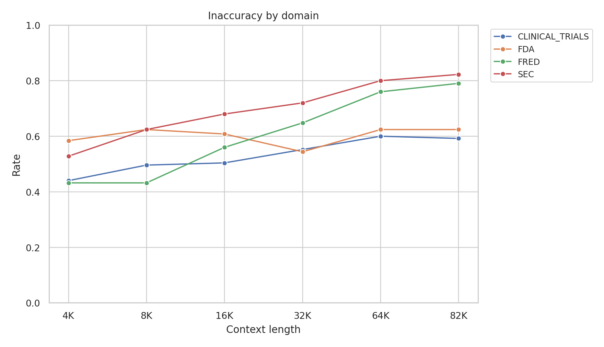

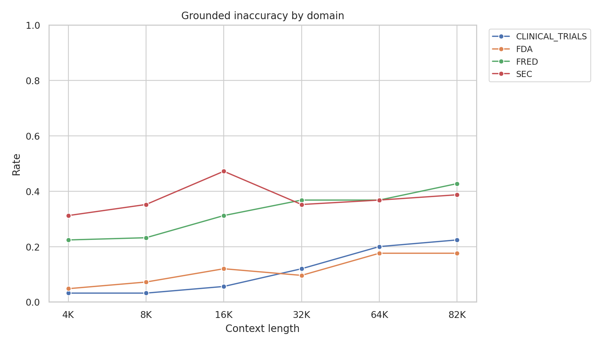

## 16. Error-Type Evolution

| Error Type             |   4K |   8K |   16K |   32K |   64K |   82K |   82K - 4K |
|:-----------------------|-----:|-----:|------:|------:|------:|------:|-----------:|
| CALCULATION_ERROR      |   12 |    9 |     8 |    12 |    14 |    13 |          1 |
| FAILED_TO_ABSTAIN      |   49 |   51 |    62 |    77 |    99 |    97 |         48 |
| UNNECESSARY_ABSTENTION |   11 |    5 |    20 |     8 |    12 |    10 |         -1 |
| UNSUPPORTED_VALUE      |  122 |  135 |   112 |   114 |   110 |   104 |        -18 |
| WRONG_ENTITY           |   32 |   45 |    44 |    42 |    43 |    47 |         15 |
| WRONG_FIELD            |    1 |    1 |     4 |     6 |    12 |    15 |         14 |
| WRONG_PERIOD           |    6 |   10 |    19 |    19 |    35 |    45 |         39 |
| WRONG_SERIES_VARIANT   |    2 |    3 |     2 |     3 |     1 |     2 |          0 |
| WRONG_UNIT             |    3 |    2 |     0 |     2 |     0 |     1 |         -2 |
| WRONG_VERSION          |   10 |   11 |    23 |    25 |    22 |    18 |          8 |

The largest 4K-to-82K increases were FAILED_TO_ABSTAIN (+48), WRONG_PERIOD (+39), WRONG_ENTITY (+15), and WRONG_FIELD (+14). UNSUPPORTED_VALUE decreased by 18. The growth in total inaccuracy is therefore not primarily due to arbitrary unsupported-value fabrication; it is substantially driven by abstention failure and contextual misbinding.

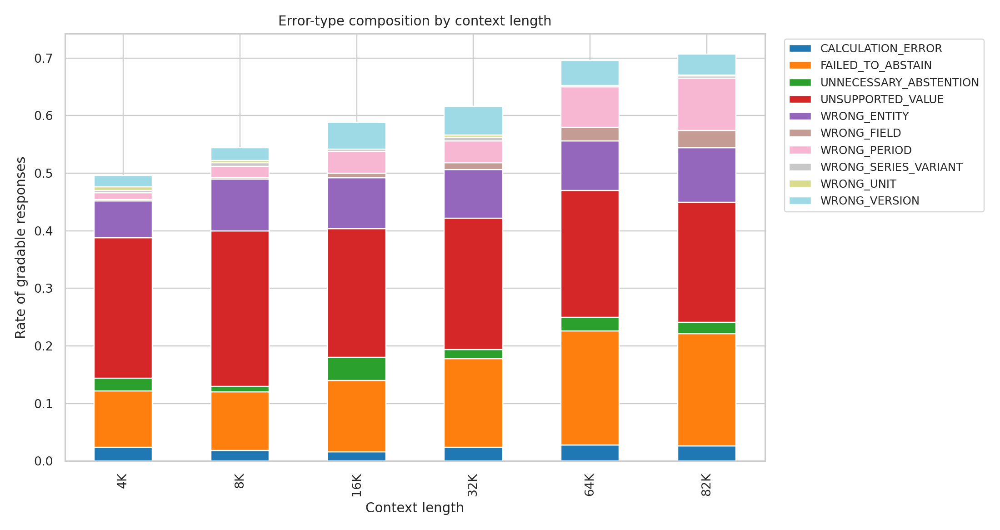

## 17. Latency

| Context   |   N | Mean     | Median   | P95      | P99      | Mean Input Tokens   |   Mean Output Tokens |
|:----------|----:|:---------|:---------|:---------|:---------|:--------------------|---------------------:|
| 4K        | 500 | 0.316 s  | 0.315 s  | 0.350 s  | 0.355 s  | 4,273.3             |                  8.4 |
| 8K        | 500 | 0.598 s  | 0.597 s  | 0.635 s  | 0.641 s  | 8,330.5             |                  8.3 |
| 16K       | 500 | 1.212 s  | 1.211 s  | 1.260 s  | 1.268 s  | 16,442.3            |                  8.3 |
| 32K       | 500 | 2.842 s  | 2.832 s  | 2.938 s  | 2.944 s  | 32,671.4            |                  8.3 |
| 64K       | 500 | 7.827 s  | 7.804 s  | 7.959 s  | 7.968 s  | 65,126.1            |                  8.2 |
| 82K       | 498 | 11.260 s | 11.251 s | 11.385 s | 11.409 s | 81,745.1            |                  8.3 |

Inference cost increased sharply with context length. Factual reliability declined while inference latency rose, but this report does not claim that latency causes factual errors.

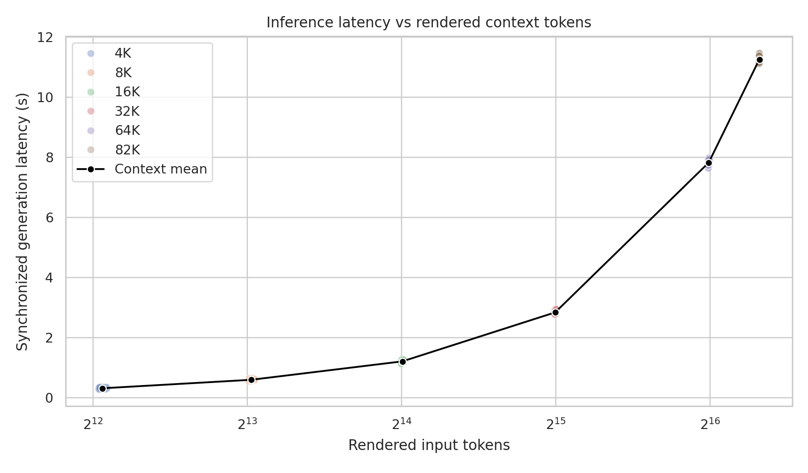

## 18. Family-Level Transitions

Family-level trajectories were heterogeneous. Some families were inaccurate at all available contexts; others first became inaccurate at longer contexts or showed non-monotonic recovery. The transition heatmap visualizes Correct, Hallucinatory Inaccuracy, and Grounded Inaccuracy across the six context conditions.

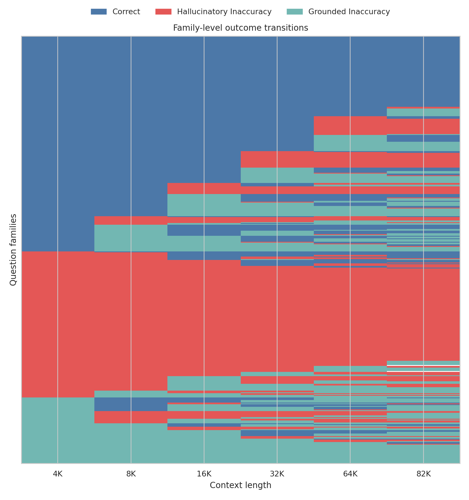

## 19. Discussion

The dominant result is that increasing context length substantially reduces factual reliability. However, this degradation is not captured adequately by a single hallucination metric. Longer contexts introduce more authentic competing information, and the model increasingly selects, binds, or reasons over legitimate but incorrect contextual records. This grounded contextual-confusion mechanism is distinct from classical unsupported hallucination.

The full dataset shows increasing Hallucinatory Inaccuracy, but the sensitivity analysis demonstrates that this is driven primarily by failed abstention on unanswerable questions. On answerable factual tasks, Hallucinatory Inaccuracy decreases while Grounded Inaccuracy increases. This distinction matters for benchmark design and for mitigation: preventing unsupported fabrication is not the same as improving entity, period, version, field, and series binding under long-context pressure.

## 20. Limitations

- One model: Llama 3.2 3B Instruct.
- One hardware/inference configuration.
- 500 question families across four structured factual domains.
- Context tested through approximately 82K rendered input tokens.
- Two 82K CUDA OOM runtime failures.
- Answer-only model output, with no evidence-selection metric in Experiment D.
- Deterministic grading plus 19 manually adjudicated edge cases.
- The benchmark intentionally contains high-quality competing distractors.
- Subgroup analyses are exploratory.
- GEE was used rather than a full GLMM.
- Results may not generalize directly to larger or proprietary LLMs.

## 21. Conclusion

Inaccuracy increased from **49.6%** at 4K to **70.7%** at 82K. The primary GEE model estimated an inaccuracy OR of **1.232** per context doubling, p = **8.66e-20**. Grounded Inaccuracy increased from **15.4%** to **30.3%**, OR **1.215**, p = **3.34e-13**. Hallucinatory Inaccuracy increased from **34.2%** to **40.4%** in the full dataset, OR **1.070**, p = **0.00133**, but excluding unanswerable tasks reversed that trend, OR **0.942**, p = **0.00275**.

Increasing context length substantially reduces factual reliability. The most robust mechanism on answerable factual tasks is an increase in grounded contextual confusion rather than an increase in unsupported fabrication.

## Appendix A. Reproducibility and Provenance

- Final JSONL hash: `8fa4fd3b990adf54b6f7790ed6defa9c5d89aa6dd8365e0a7519beeb44d985e8`
- Final CSV hash: `155f80ec3bf284a7928ede0d24b491a972540b77dfe01d98eb622825c9c06a78`
- Benchmark hash: `dc2c4194dedb090198e6883735257908ce274bebc8611b40d958dbd026aa1fe6`
- Grader hash: `d9282a0ccc50daba3bfd232c058dfbab63a5c19a7323d585a7c2236b3a6c4ba8`
- Prompt hash: `5d2869822989e19b`
- Model revision: `0cb88a4f764b7a12671c53f0838cd831a0843b95`
- Bootstrap seed: `20260811`
- Bootstrap replicates: `10000`
- GEE specification: `binary_outcome ~ context_log2, clustered by question_family_id`
- Working correlation: `Exchangeable`
